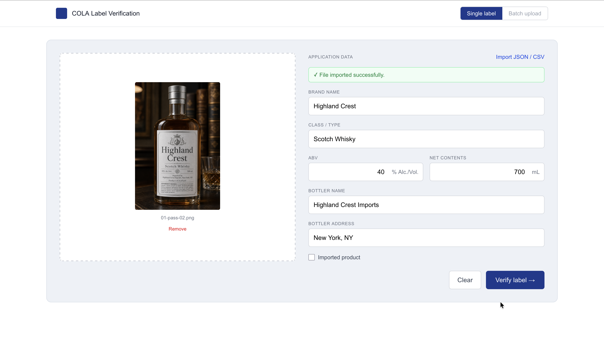
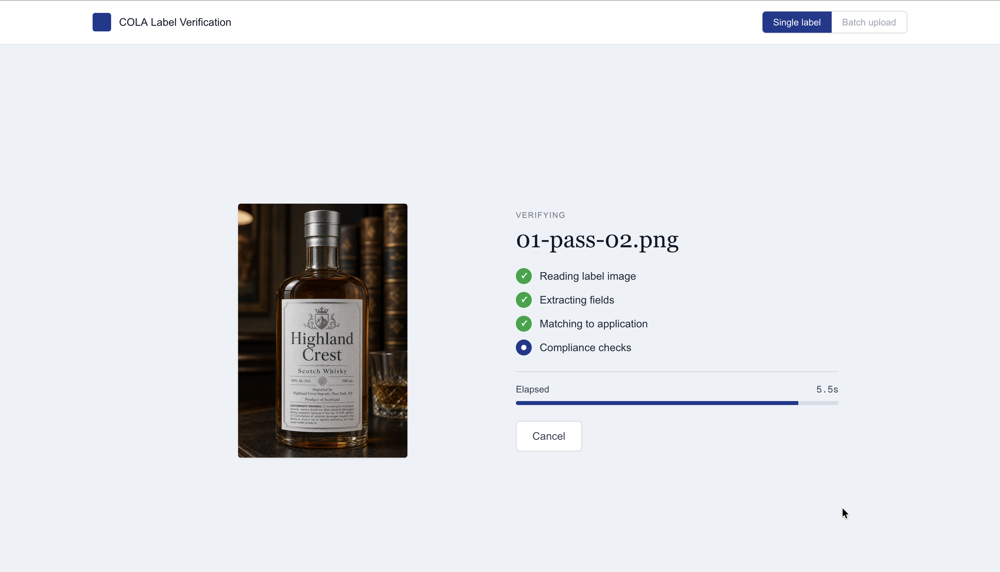
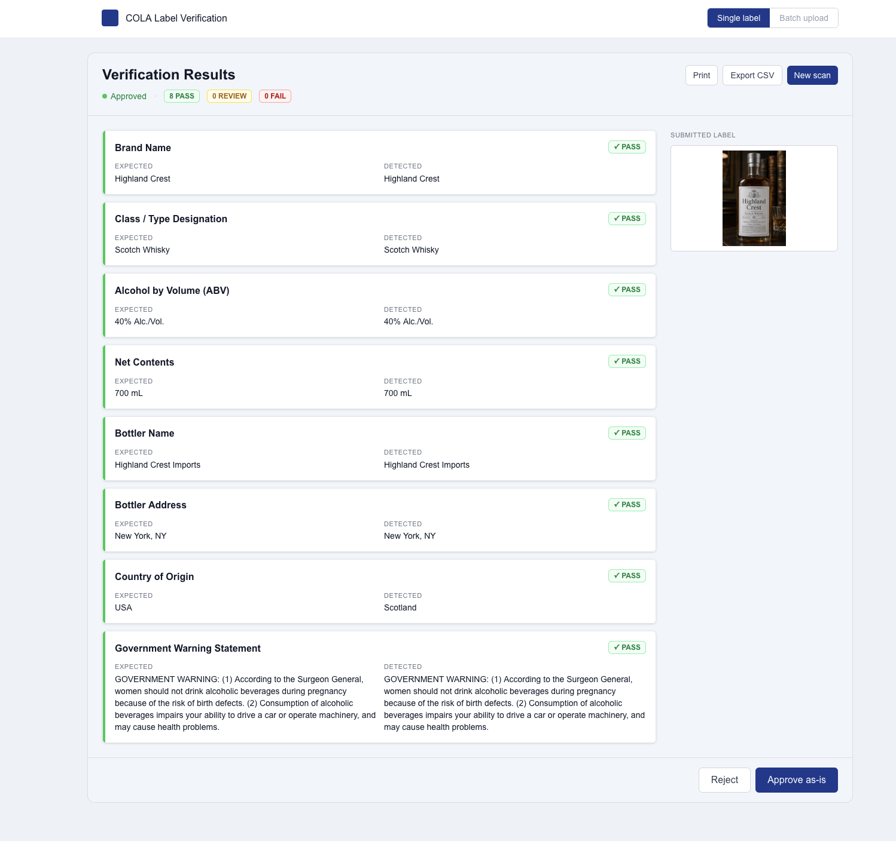

# TTB COLA Label Verifier

AI-powered label verification tool for TTB compliance agents. Upload a label image and application data — the system checks that they match and meet COLA requirements (27 CFR Part 5).

**Scope of this deployment:** distilled spirits only. The compliance engine surfaces advisories for four TTB rule areas — **bottle size** (standards of fill, 27 CFR 5.47), **state of distillation** (origin disclosure for "straight" designations, 27 CFR 5.36), **statement of composition** (required for liqueurs, cordials, and specialty/flavored products, 27 CFR 5.39), and **non-standard production statements** (terms like "small batch", "handcrafted", "estate" — 27 CFR 5.36). Wine and malt beverages are not yet implemented.

## Live Demo

Deployed URL: https://cola-verify.vercel.app/

---

## At a glance

| 1. Upload + form | 2. Verifying | 3. Results |
|---|---|---|
|  |  |  |

---

## How to Use

1. **Upload a label image** — JPEG, PNG, or WEBP, max 10 MB
2. **Enter application data** — fill in the form fields, or click "Import from JSON / CSV" to upload a file
3. **Click Analyze Label** — results appear in under 5 seconds
4. **Review per-field results** — each field shows PASS / FAIL / REVIEW with an explanation

---

## Importing Application Data

### JSON format

```json
{
  "brand_name": "Old Tom Distillery",
  "class_type": "Kentucky Straight Bourbon Whiskey",
  "abv": "45% Alc./Vol.",
  "net_contents": "750 mL",
  "bottler_name": "Old Tom Distillery Co.",
  "bottler_address": "Louisville, KY 40202",
  "country_of_origin": "USA",
  "government_warning": "GOVERNMENT WARNING: (1) According to the Surgeon General...",
  "is_import": false
}
```

### CSV format

```csv
brand_name,class_type,abv,net_contents,bottler_name,bottler_address,country_of_origin
Old Tom Distillery,Kentucky Straight Bourbon Whiskey,45% Alc./Vol.,750 mL,Old Tom Distillery Co.,"Louisville, KY 40202",USA
```

Flexible column headers accepted (e.g. `brand`, `alcohol by volume`, `bottler`, `address`).

---

## COLA Fields Verified (Distilled Spirits — 27 CFR Part 5)

| Field | Validation Method | CFR Reference |
|---|---|---|
| Brand Name | Case-insensitive fuzzy match | 27 CFR 5.34 |
| Class / Type | Semantic + approved designation list | 27 CFR 5.22 |
| Alcohol by Volume | Numeric comparison (tolerates format variants) | 27 CFR 5.52 |
| Net Contents | Unit-normalized comparison (mL/L) | 27 CFR 5.53 |
| Bottler Name | Fuzzy match | 27 CFR 5.54 |
| Bottler Address | Fuzzy match | 27 CFR 5.54 |
| Country of Origin | Fuzzy match (imports only) | 27 CFR 5.56 |
| Government Warning | Exact text + ALL CAPS check | 27 CFR 16.20 |

---

## Compliance interpretation — case sensitivity and address strictness

The validator is intentionally strict in some places and lenient in others, based on a reading of 27 CFR Part 5:

**Case-insensitive (label and application can use different casing):**
- Brand name, bottler/producer name, and class/type designation all pass when the only difference is letter case. TTB does not mandate exact case match for these fields; the only mandatory case rule is the `GOVERNMENT WARNING:` prefix (27 CFR 16.21), which the system enforces.

**Application address as a substring of label address passes:**
- If the agent submits `"Port Ellen, Isle of Islay"` and the label shows `"PORT ELLEN, ISLE OF ISLAY PA42 7DZ, SCOTLAND"`, the system passes the field. The label is fully compliant; the application is just less detailed. This pattern is common for foreign products where the label adds postal code and country.

**Class/type designation must match the label exactly (in substance, not case):**
- If the agent submits `"Scotch Whisky"` but the label shows `"Islay Single Malt Scotch Whisky"`, the system fails the field. The label has a more specific designation (which is itself compliant), but the application has not captured what the label actually says. The agent must transcribe the label's full class designation. This is enforced because an incomplete application is a compliance miss under 27 CFR 5.36 (name and address; class designation is required as printed). The system intentionally surfaces this as `fail` so the agent corrects the application before submission.

**Government warning is statutorily exact:**
- See `docs/specs/govwarn-100pct-threshold.md` for the three-tier distance model. Body casing is folded (per BUG-09); wording deviations route to warning or fail by character distance.

---

## Trade-offs and Limitations

- **Gemini extraction accuracy**: Targets >= 90% per-field accuracy. Poorly lit or angled photos will reduce accuracy. Image preprocessing is out of scope for v1.
- **Distilled spirits only**: Wine (27 CFR Part 4) and beer (27 CFR Part 7) are future iterations — the validator architecture is modular and ready to extend.
- **Class/type designation list**: The approved designations in `spirits.ts` are representative. A production deployment should import the complete 27 CFR Part 5 list.
- **Batch upload**: Not in scope for v1. Architecture supports it — add a queue and aggregate results view.
- **No persistent storage**: Results are not saved. Intentional for prototype (no PII concerns, no retention policy).

---

# For developers

## Quick Start

### 1. Clone and install

```bash
git clone <repo-url>
cd cola-verify
npm install
```

### 2. Set up environment

```bash
cp .env.local.example .env.local
# Edit .env.local and add your Gemini API key
# Get one at: https://aistudio.google.com/app/apikey
```

### 3. Run development server

```bash
npm run dev
# Open http://localhost:3000
```

---

## Architecture

Per request, the validator runs in this order:

1. **Gemini Vision** extracts structured JSON from the label image.
2. **Cross-validation** (`lib/validators/spirits.ts`) compares extracted fields against the submitted application — regex for ABV / net contents / government warning, fuzzy match for brand and address. Drives the `PASS / FAIL / REVIEW` headline.
3. **Compliance engine** (`lib/validators/compliance.ts`) checks the label itself against 27 CFR Part 5 and emits advisories. **Advisories never affect the headline** — a green PASS can coexist with advisories.

Per-beverage validators are modular: a new beverage type (wine, beer/malt) gets its own `lib/validators/<type>.ts` plus its own evals.

---

## Tech Stack

| Layer | Choice |
|---|---|
| Framework | Next.js 16 (App Router, TypeScript) |
| AI Vision | Google Gemini 2.5 Flash Lite (`@google/generative-ai`) |
| Styling | Tailwind CSS v4 |
| CSV parsing | PapaParse |
| Testing | Vitest |
| Deploy | Vercel |

---

## Running Tests

```bash
npm test           # run all unit + pipeline tests once
npm run test:watch # watch mode
```

Test coverage:
- **ABV parsing and comparison** — format variants, proof conversion, range validation
- **Net contents** — mL/L unit normalization, format variants
- **Government warning** — exact text, ALL CAPS check, missing warning
- **Fuzzy text matching** — case insensitivity, whitespace, similarity scoring
- **JSON/CSV parsers** — valid, invalid, missing fields, unknown columns
- **Full pipeline** — 6 fixture cases including the all-caps brand name case and title-case warning case

<details>
<summary><strong>Fixture-based end-to-end evals</strong></summary>

In addition to the unit and pipeline tests above, the project ships **30 manually-generated label fixtures** (image + matching JSON) that exercise the full live system — image upload through Gemini Vision extraction through validation. Each fixture is categorized by what behavior it should produce.

| Category | Count | What it tests |
|---|---|---|
| `01-pass-*` | 3 | Clean labels that should produce all-green PASS |
| `02-mismatch-*` | 5 | Label is correct but JSON has a deliberate field mismatch — should FAIL cross-validation |
| `03-noncompliant-*` | 5 | JSON matches label, but label has a TTB rule violation — should PASS cross-validation with an advisory flag |
| `04-noncompliant-*` | 9 | Same idea as 03 but with a wider variety of compliance issues + a `reason` field in the JSON |
| `05-warning-bad-*` | 4 | Government warning obviously wrong (missing, wrong capitalization, truncated, wrong wording) — should FAIL |
| `06-warning-sneaky-*` | 4 | Government warning subtly wrong (single-word substitutions a casual reader might miss) |

Fixtures live in `evals/fixtures/generated/` — each `<id>.png` + `<id>.json` pair, plus `manifest.json` describing the expected behavior for each case.

#### Two scripts

```bash
npm run eval:quick   # One fixture per category (6 cases, ~30s) — fast smoke test
npm run eval:full    # Full sweep across all 30 fixtures (~5 min)
```

Both scripts hit `http://localhost:3000` by default. Start the dev server in another terminal first (`npm run dev`), or override the URL to test the deployed system:

```bash
npm run eval:quick -- --url=https://cola-verify.vercel.app
npm run eval:full -- --url=https://cola-verify.vercel.app
```

Other flags (apply to both scripts):

| Flag | Effect |
|---|---|
| `--verbose` | Show which field failed and what advisories fired (already on for `eval:quick`) |
| `--only=<id>,<id>` | Run only a specific list of fixture IDs (overrides the quick set) |

#### Output

Each case prints either `✓` (matched expected behavior) or `✗` (didn't match). At the end, a per-category summary shows which cases failed and why. Example:

```
[01-pass-01] Clean Kentucky bourbon         … ✓ PASS  failed=0  adv=0
[02-mismatch-01] JSON wrong brand           … ✓ FAIL  failed=1  adv=0
     ↳ brand_name: Brand Name mismatch: submitted "Wrong Brand" vs label "Smoky Hollow"
──────────────────────────────────────────────────────────────────────
Done in 31.2s — 2/2 matched expectations
```

#### Cost note

Each fixture invocation costs one Gemini Vision call (~$0.0001 on `gemini-2.5-flash-lite`). Full sweep ≈ $0.005. Quick sweep ≈ $0.001. Free tier is capped at 20 requests/day per model — the **paid tier** is needed to run a full sweep without hitting quota.

#### Tracked findings

Bugs surfaced from these evals are tracked in [docs/bugs.md](docs/bugs.md). Don't fix bugs in passing — each entry has a scope and acceptance criteria.

</details>

---

## Environment Variables

| Variable | Description |
|---|---|
| `GEMINI_API_KEY` | Google Gemini API key (required) |

---

## Deploying to Vercel

Vercel auto-deploys on push to `main` via the GitHub integration. For a one-off manual deploy:

```bash
npm install -g vercel
vercel
# Add GEMINI_API_KEY in Vercel project settings -> Environment Variables
```
